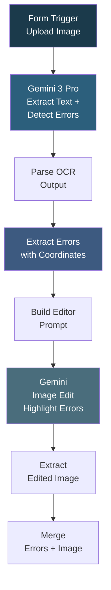

# OCR Detection with Error Image

## Overview

A packaging OCR error detection workflow that not only finds text errors but also attempts to generate an annotated image highlighting where the errors are. It uploads a packaging image via a form, uses Gemini 3 Pro to extract all text and detect spelling, grammar, spacing, and consistency errors, then maps each error to coordinates using OCR token matching. The error locations and color-coded types are compiled into an editor prompt, which is sent back to Gemini's image editing capability to produce a highlighted version of the original image showing where each error occurs.

## How It Works

```
Form (upload image) -> Gemini 3 Pro (extract text + detect errors) -> Parse and clean OCR output -> Extract errors with coordinates -> Map error types to colors (red=spelling, blue=grammar, etc.) -> Build editor prompt with coordinates -> Gemini Image Edit (highlight errors on image) -> Extract edited image to base64 -> Merge errors + image -> Final combined output
```

### Workflow Diagram



## Integrations

- **Google Gemini (3 Pro Preview)** - Text extraction, error detection, and image editing/highlighting

## Setup

1. Import `OCR_Detecction_with_error_image.json` into your n8n instance.
2. Configure Google Gemini credentials.
3. Activate and submit the form with a packaging image.
